# harny

[](https://www.npmjs.com/package/@lfnovo/harny)
[](./CHANGELOG.md)

**The agentic-workflow execution platform — auto-evolving, explainable (auditable), with structured observation and automated improvement-proposal — built for teams that want to extract more value from their AI investments, especially with Claude Code.**

The thesis: as AI does more of the implementation work, the human role splits into two — **make decisions** or **evolve the workflow the AI uses**. Iterating the dev pipeline itself becomes the dominant work of practically every dev. Harny is built to be the place where that work happens.

The mechanism: a planner → developer → validator discipline that catches bad output, structured observation of every run (state.json, transcripts, history, ML features), and a meta-loop that uses those observations to propose harder prompts, missing tooling, missing docs.

## Quickstart

```sh
# Run feature-dev workflow against the current directory.
bunx @lfnovo/harny "build me a calculator CLI in calc.py"

# All runs in this directory + any registered cross-project assistants.
bunx @lfnovo/harny ls

# Visual viewer with run timeline, plan, sibling-branch warnings, Phoenix deep-links.
bunx @lfnovo/harny ui
```

`harny` requires [Bun](https://bun.sh) >= 1.3. The first `bunx` invocation installs the package; subsequent ones run instantly. For frequent use:

```sh
bun add -g @lfnovo/harny
harny "<prompt>"
```

## How it works

A run goes through three phases by default (`feature-dev` workflow):

1. **Planner** reads the prompt, explores the codebase, emits a structured plan (`plan.json`).
2. **Developer** picks up the next pending task, makes code changes in a git worktree.
3. **Validator** runs read-only against the uncommitted tree, returns pass/fail with evidence.

On `pass`, harny composes the commit message and commits. On `fail`, the developer's session resumes with the validator's feedback. After N failed retries, the tree is reset and a fresh developer session starts. Every step is captured in `<cwd>/.harny/<slug>/state.json` — single source of truth, atomic writes, inspectable any time.

Other built-in workflows:

```sh
bunx @lfnovo/harny --workflow docs --input intent.json "document the CLI"
bunx @lfnovo/harny --workflow issue-triage --input issue.json "triage this issue"
bunx @lfnovo/harny --workflow feature-dev-engine "build me X"   # XState-based engine workflow (v0.2.0 preview)
```

## Architecture

A quick map of the moving parts. Solid arrows are control flow; dotted arrows are data / observation.

```mermaid
flowchart TB
    User(("User / Claude Code"))

    subgraph CLI["harny CLI"]
        Runner["runner.ts<br/>parse args + subcommands<br/>(ls · show · answer · ui · clean)"]
    end

    subgraph Core["Core harness"]
        Orch["orchestrator.ts<br/>git worktree · branch · state init<br/>lifecycle: dispatch · recover · exit"]
        Engine["engine runtime<br/>runEngineWorkflow<br/>XState createActor + subscribe"]
        Machine[["Workflow Machine (XState)<br/>feature-dev · auto · echoCommit · custom"]]
        Dispatchers[["Dispatchers<br/>agentActor · commandActor<br/>humanReviewActor · commitActor"]]
    end

    subgraph Ext["External effects"]
        SDK["Claude Agent SDK<br/>runPhase → structured output"]
        Git[("git worktree / branch / commit")]
    end

    subgraph Persist[".harny/&lt;slug&gt;/"]
        StateFile[("state.json<br/>single source of truth")]
        PlanFile[("plan.json<br/>feature-dev only")]
    end

    subgraph Obs["Observation"]
        Viewer["Viewer UI<br/>harny ui"]
        Phoenix["Phoenix traces<br/>opt-in (HARNY_PHOENIX_URL)"]
    end

    User --> Runner
    Runner --> Orch
    Runner --> Viewer
    Orch --> Engine
    Engine --> Machine
    Machine --> Dispatchers
    Dispatchers -- "agentActor" --> SDK
    Dispatchers -- "commitActor · commandActor" --> Git
    Orch --> Git
    Orch -. init .-> StateFile
    Machine -. "phases[] · history[]" .-> StateFile
    Machine -. write .-> PlanFile
    Viewer -. read .-> StateFile
    Viewer -. read .-> PlanFile
    Orch -. withRunSpan .-> Phoenix
    Dispatchers -. "phase spans" .-> Phoenix
```



**Reading the diagram:**

- The **runner** (CLI) is the entrypoint for both run invocations (`harny "..."`) and inspection subcommands (`ls`, `show`, `answer`, `ui`, `clean`).
- The **orchestrator** owns the run lifecycle: sets up the git worktree/branch, initializes `state.json`, and hands off to the engine runtime. It's also the sole committer after a passing validator.
- The **engine runtime** is a thin XState executor — it calls `createActor(machine)`, subscribes to `{ next, error }`, and resolves when the machine reaches a final state.
- A **workflow** is an XState machine plus a `buildActors` factory. Built-in machines: `feature-dev` (planner → loop[developer → validator → committing] → done|failed), `auto` (boundary wrapper), `echoCommit` (minimal example). Custom workflows plug into the registry.
- **Dispatchers** are the effect primitives: `agentActor` wraps a Claude SDK phase call, `commandActor` wraps `Bun.spawn`, `humanReviewActor` parks for approval, `commitActor` wraps git commit.
- **`state.json`** is the single source of truth per run — atomic writes, schema-validated, readable any time. `plan.json` is the planner's output for `feature-dev`.
- The **viewer** is strictly read-only over the state files. **Phoenix** (opt-in) receives one trace per run via OpenInference instrumentation.

## CLI

```
harny [--workflow <id>] [--name <slug>] [--assistant <name>]
      [--isolation worktree|inline] [--mode interactive|silent|async]
      [--input <path>] [-v|--verbose|--quiet]
      "<prompt>"

harny ls [--status X] [--cwd X] [--workflow X]
harny show <runId> [--tail] [--since=<duration>]   # tail = stream live phase activity
harny answer <runId> [<text> | --json '{...}']
harny clean <slug>
harny ui [--port=N] [--no-open]
```

- `--workflow` defaults to `feature-dev`.
- `--assistant` is optional; without it the run targets the current working directory.
- `--name <slug>` controls the branch name (`harny/<slug>`) and the per-run state directory. When omitted, a timestamped slug is generated.
- `--mode silent` is auto-selected when stdin is not a TTY (CI, background runs).
- `harny show <id> --tail` streams the active phase's tool activity in real time. `--since=30s|5m|1h` backfills the recent past before subscribing to new events.

## Observability (opt-in)

Set `HARNY_PHOENIX_URL` to mirror SDK transcripts and tool calls into a local [Phoenix](https://github.com/Arize-ai/phoenix) instance via Arize OpenInference. Each harny run becomes one Phoenix trace named after the task slug, with phase-named child spans and tool sub-spans.

```sh
docker run -d -p 6006:6006 arizephoenix/phoenix:latest
export HARNY_PHOENIX_URL=http://127.0.0.1:6006
bunx @lfnovo/harny "build me a calculator"
```

The viewer surfaces a deep-link to the run's Phoenix trace when this is enabled.

## Cross-project registry (optional)

`~/.harny/assistants.json` registers named working directories. With it, you can:

- Run `harny --assistant my-app "..."` from any directory and have it execute against the registered cwd.
- See runs from all registered projects in `harny ls` and `harny ui`.

```jsonc
{
  "assistants": [
    { "name": "my-app", "cwd": "/Users/me/projects/my-app" },
    { "name": "harny",  "cwd": "/Users/me/dev/harny" }
  ]
}
```

See `assistants.example.json`.

## Per-project config

A repo can ship `harny.json` to override per-phase prompts, tools, model, max turns, MCP servers, isolation mode, default run mode, iteration caps, and platform toggles:

```jsonc
{
  "phases": {
    "planner":   { "model": "sonnet", "maxTurns": 50 },
    "developer": { "model": "sonnet", "maxTurns": 200 },
    "validator": { "model": "sonnet" }
  },
  "isolation": "worktree",
  "defaultMode": "silent",
  "maxIterationsPerTask": 3,
  "maxRetriesBeforeReset": 1,
  "maxIterationsGlobal": 30,
  "coldWorktreeInstall": true,    // auto bun install in fresh worktrees (default true)
  "siblingBranchGuard": true      // post-developer check for unmerged sibling branches touching the same files (default true)
}
```

See `harny.example.json`.

## Custom workflows (preview — v0.2.0 engine layer)

Beyond the built-in `feature-dev`, `docs`, `issue-triage`, and `feature-dev-engine` workflows, you can ship your own as a TypeScript file under `<cwd>/.harny/workflows/<id>.ts` (loader landing in v0.2.0 Phase 2). Engine workflows are XState v5 machines with three primitives:

- `agentActor` — wraps a Claude SDK phase call.
- `commandActor` — wraps `Bun.spawn`.
- `humanReviewActor` — pauses for human approval / refinement.

See [`src/harness/engine/workflows/echoCommit.ts`](./src/harness/engine/workflows/echoCommit.ts) for a 60-line working example; [`src/harness/engine/CLAUDE.md`](./src/harness/engine/CLAUDE.md) for engine conventions.

## What you get out of the box

- **Discipline** — planner / developer / validator separation catches bad output before it merges.
- **Auditability** — every phase emits structured output (Zod-validated); every run produces `state.json` + transcripts + history.
- **Sibling-branch guard** — automatic detection when your dev touches files another harness branch already owns (prevents silent merge regressions).
- **Cold-install** — fresh worktrees auto-`bun install` so phases never hit missing-module errors.
- **Live tail** — `harny show <id> --tail` for streaming view of running phases.
- **Cross-project view** — one `harny ui` shows runs across all your registered projects.
- **Phoenix integration** — opt-in OpenInference traces, one per run.

## Plugin (Claude Code)

The `plugin/` directory ships `harny-plugin` — a Claude Code plugin with skills and an orchestrator agent that make it natural to use harny from a Claude Code conversation. Versioned independently of the CLI.

```bash
# Permanent install via marketplace
claude plugin marketplace add /path/to/harny    # or: lfnovo/harny once published
claude plugin install harny-plugin

# Session-only (no global install, no marketplace)
claude --plugin-dir /path/to/harny/plugin
```

Once installed, you get:

- `/harny-plugin:harny` — onboarding + router; start here if new to harny.
- `/harny-plugin:check-repo` — pre-flight readiness assessment.
- `/harny-plugin:learn` — fast capture of a learning into the local inbox.
- `/harny-plugin:drain` — analytical triage of accumulated learnings.
- `/harny-plugin:review` — per-run post-mortem with leaves-to-trunk analysis.
- `/harny-plugin:release` — operate as release manager across multiple runs.
- `harny-orchestrator` agent — dispatches and monitors harny runs from natural-language intent.

See [`plugin/README.md`](plugin/README.md) for the full surface.

## Development

This repo is the source of `harny` itself. To work on it:

```sh
git clone https://github.com/lfnovo/harny
cd harny
bun install
bun run typecheck
bun run harny -- "test prompt"        # local invocation
bun bin/harny.ts ui                   # viewer against local runs
```

Internals live under `src/harness/` (workflows, orchestrator, state, observability), `src/harness/engine/` (XState v0.2.0 layer), and `src/viewer/`. See [`CLAUDE.md`](./CLAUDE.md) for an exhaustive map and the invariants the codebase upholds.

## Releasing

Publishes are tag-driven via `.github/workflows/publish.yml`:

```sh
# 1. bump version in package.json (e.g. 0.1.0 -> 0.1.1)
# 2. update CHANGELOG.md (move [Unreleased] entries under a new [0.1.1] section)
git commit -am "chore(release): v0.1.1"
git tag v0.1.1
git push origin main v0.1.1
```

The action validates that `package.json:version` matches the tag, runs `bun run typecheck`, and publishes via `npm publish --access public` using the `NPM_TOKEN` repo secret.

## Self-hosting

harny is built BY harny — the harness that exists today is used to develop the harness of tomorrow. TS production code only lands through harness runs; the policy rules, per-run loop, and cheap-validator patterns live in the [`harny-release`](./.claude/skills/harny-release/) skill. Per-run post-mortem via [`harny-review`](./.claude/skills/harny-review/). Architect learnings captured and drained via [`harny-learnings`](./.claude/skills/harny-learnings/).

See [`CLAUDE.md`](./CLAUDE.md) for codebase invariants, key paths, and gotchas. Open decisions and proposals live in [GitHub Issues](https://github.com/lfnovo/harny/issues) and [Discussions](https://github.com/lfnovo/harny/discussions).

## License

MIT
